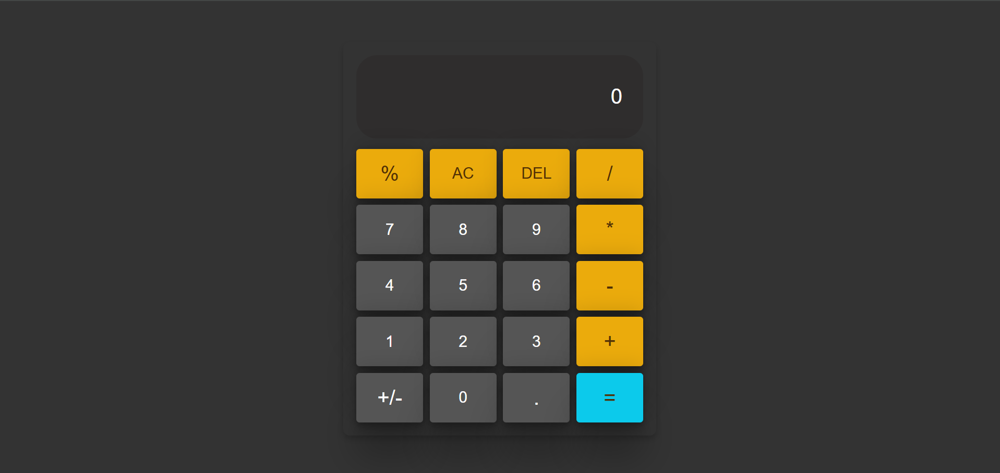

# Internship-Task-4

This project is a simple web-based calculator designed as part of Internship Task 4. It includes basic arithmetic operations and a user-friendly interface built using HTML, CSS, and JavaScript.

# Features

-Basic arithmetic operations: Addition, Subtraction, Multiplication, Division
 
-Percentage calculation
 
-Clear all (AC) and Delete (DEL) functionality
 
-Positive/Negative toggle (+/-)
 
-Decimal input support
 
-Responsive design for mobile compatibility

# Technologies Used

-HTML: Structure of the calculator
 
-CSS: Styling and layout design
 
-JavaScript: Logic for calculator operations

# Demo link & Screenshot:

-link: 
https://akankshap-internship-task-4.netlify.app/
 

-Screenshot: 

